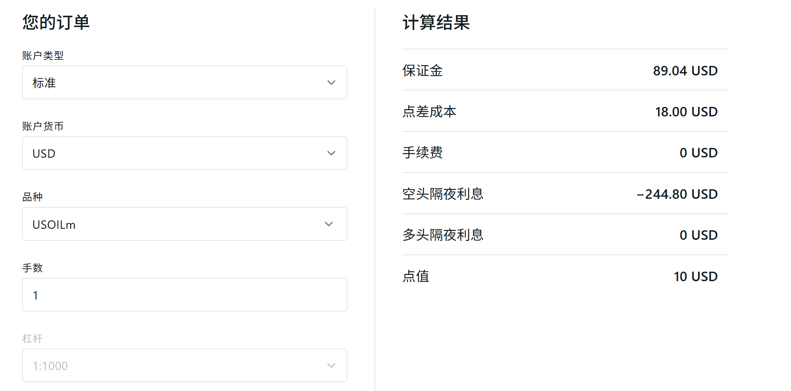
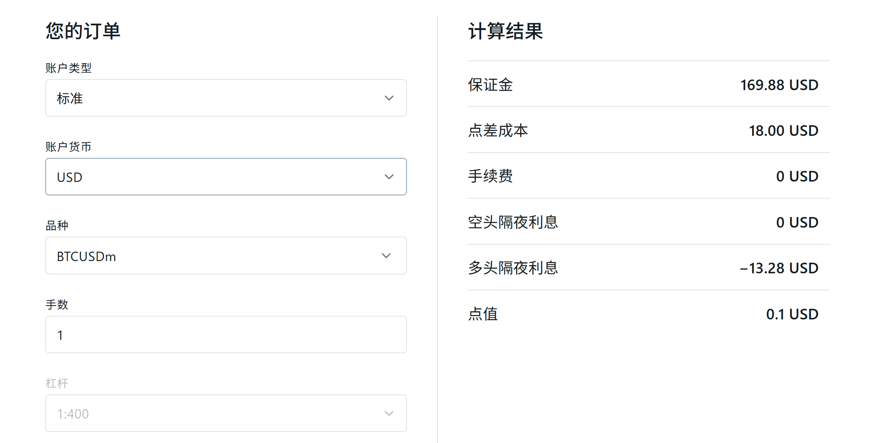

# QuantificationMt5
Quantification use Mt5

# 利润计算
## BTCUSDm
1手跳动一个点的利润是1，0.01手跳动一个点的利润是0.01

# 手续费
## Usoil

1手的点差手续费 = 18 * 1
任意手的点差手续费 = 18 * volume * 1
1手跳动1个点的利润 = 10

1手的点差手续费 = 18 * 1
任意手的点差手续费 = 18 * volume * 1
1手跳动1个点的利润 = 0.1